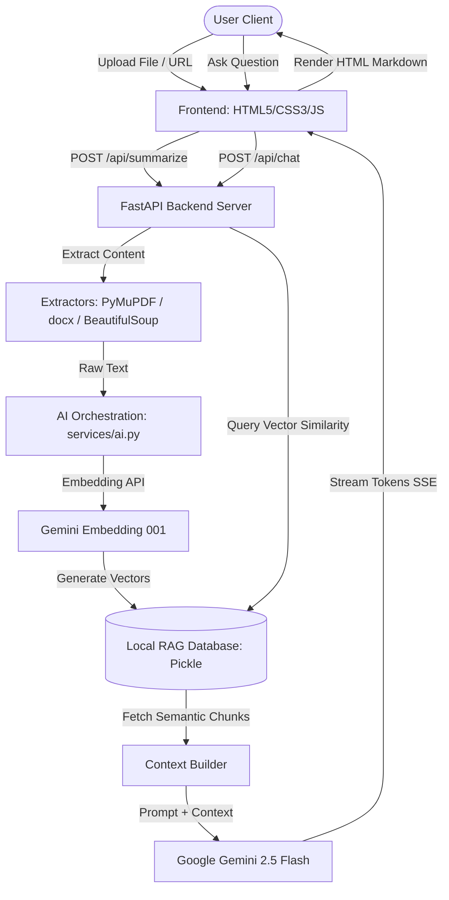

# QuickAI 🚀
> **An Advanced Multimodal Document Summarization, Interactive Translation, and RAG Chat Platform.**

QuickAI (also known as AetherAI/NexusAI) is an enterprise-grade, multimodal document analysis platform. It allows users to upload documents (PDF, DOCX, TXT), images, or audio files, as well as scrape live websites. It processes content via Google Gemini models, generating real-time streaming summaries, reliability scores, and hosting an interactive retrieval-augmented generation (RAG) chat engine.

---

## 🌟 Key Features

*   **Multimodal File Support**: Upload and extract insights from PDFs, Word documents (`.docx`), plain text files, images (`.png`, `.jpg`, `.jpeg`), and audio recordings (`.mp3`, `.wav`, `.m4a`).
*   **Real-time Streaming Engine (SSE)**: Leverages Server-Sent Events to stream summary and chat responses token-by-token in real-time, creating a fast and responsive typing effect.
*   **Custom RAG (Retrieval-Augmented Generation)**: Uses `models/gemini-embedding-001` to encode document text chunks into 768-dimensional dense vectors and hosts them locally in a high-performance vector database to prevent AI hallucinations.
*   **Responsible AI (RAI) Trust Scoring**: Employs an evaluation prompt to measure factuality, potential bias, and source authority, presenting a calculated "Trust Score" (0–100) alongside each summary.
*   **Web Scraper Integration**: Input any web URL to automatically scrape clean article text (stripping navigation, ads, and scripts) for immediate processing.
*   **Built-in Translation Engine**: Instantly translate summarized documents into English, Hindi, or Sanskrit.
*   **Voice Assistant (Text-to-Speech & Speech-to-Text)**: Reads summaries aloud using the native Web Speech API and supports hands-free voice chat input.
*   **Live Analytics Dashboard**: Includes a statistics dashboard featuring charts (via `Chart.js`) illustrating processed document types, languages, and cumulative chat sessions.
*   **QR-Code Mobile Handover**: Instantly generates share IDs and corresponding QR codes, enabling users to scan and read or listen to summaries on mobile devices.
*   **Quad-Theme Engine**: Easily switch between four custom-designed visual themes: Midnight, Daylight, Cyberpunk, and Forest.

---

## 🛠️ Tech Stack

### Frontend (Client-Side)
*   **Core**: HTML5, Vanilla ES6+ JavaScript (Clean client-side state handling without heavy framework overhead)
*   **Styling**: CSS3 (Modern Flexbox & Grid, Custom Properties/CSS variables for dynamic themes)
*   **Libraries**:
    *   [Marked.js](https://marked.js.org/) (Real-time streaming Markdown compiler)
    *   [html2pdf.js](https://github.com/eKoopmans/html2pdf.js) (Client-side PDF exports)
    *   [Chart.js](https://www.chartjs.org/) (Interactive analytics visualizations)
    *   [qrcode.js](https://davidshimjs.github.io/qrcodejs/) (On-the-fly QR code generation)
*   **Browser APIs**: Web Speech API (`SpeechSynthesis` & `SpeechRecognition`)

### Backend (Server-Side)
*   **Core**: Python 3.10+, FastAPI (Asynchronous high-performance web framework)
*   **Server**: Uvicorn (ASGI web server)
*   **Data Extraction**: PyMuPDF (`fitz`), python-docx, BeautifulSoup4, Requests
*   **AI Integration**: Google Generative AI SDK (Gemini 2.5 Flash Lite, Gemini Embedding 001)

---

## 📐 System Architecture



---

## 🚀 Getting Started

### Prerequisites
*   Python 3.10 or higher installed on your system.
*   A Google Gemini API key. You can get one from [Google AI Studio](https://aistudio.google.com/).

### Installation

1.  **Clone the repository**:
    ```bash
    git clone https://github.com/MarutiNandan2796/QuickAI.git
    cd QuickAI
    ```

2.  **Set up the environment variables**:
    Navigate to the `backend` directory and copy the `.env.example` file to `.env`:
    ```bash
    cd backend
    cp .env.example .env
    ```
    Open `.env` and fill in your Gemini API key:
    ```env
    GEMINI_API_KEY="your_actual_gemini_api_key_here"
    ```

3.  **Install dependencies**:
    Create a virtual environment and install the required Python packages:
    ```bash
    python -m venv venv
    # On Windows:
    venv\Scripts\activate
    # On macOS/Linux:
    source venv/bin/activate

    pip install -r requirements.txt
    ```

### Running the Application

To launch both the backend server and frontend (the FastAPI server hosts the static frontend files directly):

*   **On Windows**: Simply run the launcher script from the root directory:
    ```bash
    start_nexus.bat
    ```
*   **On macOS/Linux/Manual Windows**:
    ```bash
    cd backend
    uvicorn main:app --reload --port 8000
    ```

Once started, open your web browser and navigate to **`http://127.0.0.1:8000`** to access the application.

---

## 📊 Analytics Dashboard

The platform logs basic usage metrics (document count, chat sessions, target languages) locally into `backend/data/stats.json` securely. The frontend visualizes this data dynamically on a dashboard overlay so you can track platform utilization.

---

## 🔒 License

Distributed under the MIT License. See `LICENSE` for more information (if applicable).